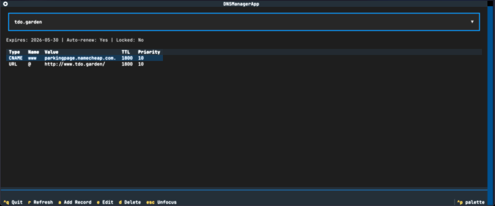

# SDK de Python para Namecheap

[](https://pypi.org/project/namecheap-python/)
[](https://pepy.tech/project/namecheap-python)
[](https://pepy.tech/project/namecheap-python)
[](https://pypi.org/project/namecheap-python/)
[](https://opensource.org/licenses/MIT)

Un SDK de Python moderno y amigable para la API de Namecheap, con herramientas integrales de CLI y TUI.

## 🚀 Características

> [!NOTE]
> **Novedad en v2.2.0:** el CLI incluye su propia [habilidad para Claude Code](#-integración-con-claude-code) — ejecuta `namecheap-cli skill install` y Claude gestionará tu DNS.

- **SDK moderno de Python** con anotaciones de tipo completas y modelos Pydantic
- **Herramienta CLI** para gestionar dominios y DNS desde la terminal
- **Aplicación TUI** para la gestión visual de registros DNS
- **Constructor DNS inteligente** con interfaz fluida para la gestión de registros
- **Autoconfiguración** desde variables de entorno
- **Mensajes de error útiles** con guía para la resolución de problemas
- **Soporte para dominios IDN y con emojis** — pasa `🧊.to` o `café.com` directamente, el punycode se maneja automáticamente
- **Registros exhaustivos** con una salida coloreada y atractiva
- **Soporte de entorno de pruebas (sandbox)** para pruebas seguras

## 🎯 Inicio Rápido

**Requiere Python 3.12 o superior**

### `namecheap-python`: Biblioteca principal del SDK de Python

```bash
# Add as a dependency to your project
uv add namecheap-python
```

```python
from namecheap import Namecheap

# Initialize (auto-loads from environment)
nc = Namecheap()

# Check domain availability
domains = nc.domains.check("example.com", "coolstartup.io")
for domain in domains:
    if domain.available:
        print(f"✅ {domain.domain} is available!")

# List your domains
my_domains = nc.domains.list()
for domain in my_domains:
    print(f"{domain.name} expires on {domain.expires}")

# Manage DNS with the builder
nc.dns.set("example.com",
    nc.dns.builder()
    .a("@", "192.0.2.1")
    .a("www", "192.0.2.1")  
    .mx("@", "mail.example.com", priority=10)
    .txt("@", "v=spf1 include:_spf.google.com ~all")
)
```

### `namecheap-cli`: Herramienta CLI

Originalmente se concibió como una prueba de concepto para mostrar `namecheap-python`, pero es una herramienta que uso personalmente

```bash
# List domains with beautiful table output

# Run it without install with:
uvx --from 'namecheap-python[cli]' namecheap-cli domain list

# Or install it permanently with:
uv tool install --python 3.12 'namecheap-python[cli]'

# Then run
namecheap-cli domain list

                    Domains (4 total)
┏━━━━━━━━━━━━━━━━━━━┳━━━━━━━━┳━━━━━━━━━━━━┳━━━━━━━━━━━━┳━━━━━━━━┓
┃ Domain            ┃ Status ┃ Expires    ┃ Auto-Renew ┃ Locked ┃
┡━━━━━━━━━━━━━━━━━━━╇━━━━━━━━╇━━━━━━━━━━━━╇━━━━━━━━━━━━╇━━━━━━━━┩
│ example.com       │ Active │ 2025-10-21 │ ✓          │        │
│ coolsite.io       │ Active │ 2026-05-25 │ ✓          │        │
│ myproject.dev     │ Active │ 2026-05-30 │ ✓          │        │
│ awesome.site      │ Active │ 2026-03-20 │ ✓          │        │
└───────────────────┴────────┴────────────┴────────────┴────────┘
```

Configúralo antes del primer uso:

```bash
# Interactive setup
namecheap-cli config init

# Creates config file at:
# - Linux/macOS: $XDG_CONFIG_HOME/namecheap/config.yaml (or ~/.config/namecheap/config.yaml)
# - Windows: %APPDATA%\namecheap\config.yaml
```
Verificar disponibilidad y precios de dominios:

```bash
# Check domain availability
❯ namecheap-cli domain check myawesome.com coolstartup.io
                Domain Availability
┏━━━━━━━━━━━━━━━━┳━━━━━━━━━━━━━━┳━━━━━━━━━━━━━━━━━━┓
┃ Domain         ┃ Available    ┃ Price (USD/year) ┃
┡━━━━━━━━━━━━━━━━╇━━━━━━━━━━━━━━╇━━━━━━━━━━━━━━━━━━┩
│ myawesome.com  │ ❌ Taken     │ -                │
│ coolstartup.io │ ✅ Available │ $34.98           │
└────────────────┴──────────────┴──────────────────┘

💡 Suggestions for taken domains:
  • myawesome.com → myawesome.net, myawesome.io, getmyawesome.com
```

Gestionar registros DNS:

En este ejemplo configuraré GitHub Pages para mi dominio `tdo.garden`

```bash
# First, check current DNS records (before setup)
namecheap-cli dns list tdo.garden

# Initial state (Namecheap default parking page):
                         DNS Records for tdo.garden (2 total)
┏━━━━━━━━━━┳━━━━━━━━━━━━━━━━━━━━━━┳━━━━━━━━━━━━━━━━━━━━━━━━━━━━┳━━━━━━━━━━┳━━━━━━━━━━┓
┃ Type     ┃ Name                 ┃ Value                      ┃ TTL      ┃ Priority ┃
┡━━━━━━━━━━╇━━━━━━━━━━━━━━━━━━━━━━╇━━━━━━━━━━━━━━━━━━━━━━━━━━━━╇━━━━━━━━━━╇━━━━━━━━━━┩
│ CNAME    │ www                  │ parkingpage.namecheap.com. │ 1800     │ 10       │
│ URL      │ @                    │ http://www.tdo.garden/     │ 1800     │ 10       │
└──────────┴──────────────────────┴────────────────────────────┴──────────┴──────────┘

# Add GitHub Pages A records for apex domain
❯ namecheap-cli dns add tdo.garden A @ 185.199.108.153
Adding A record to tdo.garden...
✅ Added A record successfully!

❯ namecheap-cli dns add tdo.garden A @ 185.199.109.153
Adding A record to tdo.garden...
✅ Added A record successfully!

❯ namecheap-cli dns add tdo.garden A @ 185.199.110.153
Adding A record to tdo.garden...
✅ Added A record successfully!

❯ namecheap-cli dns add tdo.garden A @ 185.199.111.153
Adding A record to tdo.garden...
✅ Added A record successfully!

# Add CNAME for www subdomain
❯ namecheap-cli dns add tdo.garden CNAME www adriangalilea.github.io
Adding CNAME record to tdo.garden...
✅ Added CNAME record successfully!

# Verify the setup
❯ namecheap-cli dns list tdo.garden

# Final state with GitHub Pages + old records still present that you may want to remove:
```bash
                         DNS Records for tdo.garden (7 total)
┏━━━━━━━━━━┳━━━━━━━━━━━━━━━━━━━━━━┳━━━━━━━━━━━━━━━━━━━━━━━━━━━━┳━━━━━━━━━━┳━━━━━━━━━━┓
┃ Type     ┃ Name                 ┃ Value                      ┃ TTL      ┃ Priority ┃
┡━━━━━━━━━━╇━━━━━━━━━━━━━━━━━━━━━━╇━━━━━━━━━━━━━━━━━━━━━━━━━━━━╇━━━━━━━━━━╇━━━━━━━━━━┩
│ A        │ @                    │ 185.199.108.153            │ 1800     │ 10       │
│ A        │ @                    │ 185.199.109.153            │ 1800     │ 10       │
│ A        │ @                    │ 185.199.110.153            │ 1800     │ 10       │
│ A        │ @                    │ 185.199.111.153            │ 1800     │ 10       │
│ CNAME    │ www                  │ parkingpage.namecheap.com. │ 1800     │ 10       │
│ CNAME    │ www                  │ adriangalilea.github.io.   │ 1800     │ 10       │
│ URL      │ @                    │ http://www.tdo.garden/     │ 1800     │ 10       │
└──────────┴──────────────────────┴────────────────────────────┴──────────┴──────────┘
```


Verificar saldo de la cuenta:

```bash
❯ namecheap-cli account balance
          Account Balance
┏━━━━━━━━━━━━━━━━━━━━━┳━━━━━━━━━━━┓
┃ Field               ┃    Amount ┃
┡━━━━━━━━━━━━━━━━━━━━━╇━━━━━━━━━━━┩
│ Available Balance   │  0.00 USD │
│ Account Balance     │  0.00 USD │
│ Earned Amount       │  0.00 USD │
│ Withdrawable        │  0.00 USD │
│ Auto-Renew Required │ 20.16 USD │
└─────────────────────┴───────────┘
```

Obtener información detallada del dominio:

```bash
❯ namecheap-cli domain info self.fm

Domain Information: self.fm

Status: Ok
Owner: adriangalilea
Created: 07/15/2023
Expires: 07/15/2026
Premium: No
WHOIS Guard: ✓ Enabled
DNS Provider: CUSTOM
```

También puedes exportar los registros DNS:

```bash
namecheap-cli dns export example.com --format yaml
```
### `namecheap-dns-tui`: TUI para la gestión de DNS

```bash
# Launch interactive DNS manager
namecheap-dns-tui
```



## Instalar tanto el CLI como la TUI

```bash
uv tool install --python 3.12 'namecheap-python[all]'
```

## 📖 Documentación

- **[Resumen de Ejemplos](examples/README.md)** - Ejemplos rápidos para todas las herramientas
- **[Documentación del CLI](CLI.md)** - Guía de uso, reglas de seguridad y flujos de trabajo (también funciona como la habilidad de Claude Code)
- **[Referencia de Comandos del CLI](src/namecheap_cli/COMMANDS.md)** - Cada comando y bandera, generados directamente desde el CLI
- **[Documentación de la TUI](src/namecheap_dns_tui/README.md)** - Características y uso de la TUI
- **[Inicio Rápido del SDK](examples/quickstart.py)** - Ejemplos de código en Python

## ⚙️ Configuración

### Variables de Entorno

Establece las variables de entorno en tu terminal:

```bash
# Required
NAMECHEAP_API_KEY=your-api-key
NAMECHEAP_USERNAME=your-username

# Optional
NAMECHEAP_API_USER=api-username  # defaults to USERNAME
NAMECHEAP_CLIENT_IP=auto         # auto-detected if not set
NAMECHEAP_SANDBOX=false          # use production API
```

### Archivos `.env`

El CLI carga automáticamente `.env` desde el directorio de trabajo actual, por lo que `cd ~/project && namecheap-cli ...` simplemente funciona.

El SDK **no** lee `.env` implícitamente (las bibliotecas no deberían acceder al sistema de archivos al instanciarse). Si tu código usa un archivo `.env`, cárgalo explícitamente:

```python
from dotenv import load_dotenv
load_dotenv()
nc = Namecheap()

# or, equivalently:
nc = Namecheap.from_env_file(".env")
```

### Configuración en Python

```python
from namecheap import Namecheap

nc = Namecheap(
    api_key="your-api-key",
    username="your-username", 
    api_user="api-username",    # Optional
    client_ip="1.2.3.4",       # Optional, auto-detected
    sandbox=False              # Production mode
)
```

### IP Estática a través de un proxy

La API de Namecheap requiere agregar tu IP cliente a la lista blanca — algo tedioso cuando tu IP doméstica rota o tus ejecutores de CI obtienen IPs aleatorias. En lugar de estar agregando a la lista blanca permanentemente, enruta las llamadas a la API a través de cualquier servidor que controles con IP estática (una VPS de $5 funciona).

El SDK utiliza [httpx](https://www.python-httpx.org/), que respeta las variables de entorno de proxy estándar de forma nativa. Para proxies SOCKS, instala el extra `socks`:

```bash
uv add 'namecheap-python[socks]'
```

Luego, crea un túnel a través de tu servidor con IP estática y apunta la variable de entorno del proxy hacia él:

```bash
# SOCKS tunnel over SSH — no server setup needed
ssh -f -N -D 1080 your-vps

ALL_PROXY=socks5://127.0.0.1:1080 namecheap-cli domain list
```

Agrega la IP de la VPS a la lista blanca una sola vez en Namecheap (Perfil → Herramientas → Acceso a la API) y establece `NAMECHEAP_CLIENT_IP` con esa IP. Ahora las llamadas a la API funcionarán desde cualquier lugar: casa, portátil en WiFi de hotel, CI — sin cambios constantes en la lista blanca. Los proxies HTTP también funcionan mediante `HTTPS_PROXY=http://...` (sin extras adicionales).

## 🔧 Uso Avanzado del SDK

### Patrón Constructor DNS

El constructor DNS proporciona una interfaz fluida para gestionar registros:

```python
# Build complex DNS configurations
nc.dns.set("example.com",
    nc.dns.builder()
    # A records
    .a("@", "192.0.2.1")
    .a("www", "192.0.2.1")
    .a("blog", "192.0.2.2")
    
    # AAAA records  
    .aaaa("@", "2001:db8::1")
    .aaaa("www", "2001:db8::1")
    
    # MX records
    .mx("@", "mail.example.com", priority=10)
    .mx("@", "mail2.example.com", priority=20)
    
    # TXT records
    .txt("@", "v=spf1 include:_spf.google.com ~all")
    .txt("_dmarc", "v=DMARC1; p=none;")
    
    # CNAME records
    .cname("blog", "myblog.wordpress.com")
    .cname("shop", "myshop.shopify.com")
    
    # URL redirects
    .url("old", "https://new-site.com", redirect_type="301")
)
```

**Nota sobre TTL:** El TTL predeterminado es de **1799 segundos**, que se muestra como **"Automático"** en la interfaz web de Namecheap. Este es un comportamiento no documentado de la API de Namecheap. Puedes especificar valores TTL personalizados (60-86400 segundos) en cualquier método DNS.

### Soporte para Dominios IDN y Emojis

```python
# Emoji domains work everywhere
ns = nc.dns.get_nameservers("🧊.to")
info = nc.domains.get_info("🧊.to")
nc.dns.set_custom_nameservers("🧊.to", ["ns1.cloudflare.com", "ns2.cloudflare.com"])

# So do IDN domains
nc.domains.check("café.com", "München.de")
```

### Gestión de Servidores de Nombres

```python
# Check current nameservers
ns = nc.dns.get_nameservers("example.com")
print(ns.nameservers)  # ['dns1.registrar-servers.com', 'dns2.registrar-servers.com']
print(ns.is_default)   # True

# Switch to custom nameservers (e.g., Cloudflare, Route 53)
nc.dns.set_custom_nameservers("example.com", [
    "ns1.cloudflare.com",
    "ns2.cloudflare.com",
])

# Reset back to Namecheap BasicDNS
nc.dns.set_default_nameservers("example.com")
```

### Información del Dominio

```python
info = nc.domains.get_info("example.com")
print(info.status)              # 'Ok'
print(info.whoisguard_enabled)  # True
print(info.dns_provider)        # 'CUSTOM'
print(info.created)             # '07/15/2023'
print(info.expires)             # '07/15/2026'
```

### Saldo de la Cuenta

```python
bal = nc.users.get_balances()
print(f"{bal.available_balance} {bal.currency}")  # '4932.96 USD'
print(bal.funds_required_for_auto_renew)          # Decimal('20.16')
```

### Precios

```python
# Get registration pricing for a specific TLD
pricing = nc.users.get_pricing("DOMAIN", action="REGISTER", product_name="com")
for p in pricing["REGISTER"]["com"]:
    print(f"{p.duration} year: ${p.your_price} (regular: ${p.regular_price})")

# Get all domain pricing (large response — cache it)
all_pricing = nc.users.get_pricing("DOMAIN")
```

### Reenvío de Correo Electrónico

```python
# Read
rules = nc.dns.get_email_forwarding("example.com")
for r in rules:
    print(f"{r.mailbox} -> {r.forward_to}")

# Write (replaces all existing rules)
nc.dns.set_email_forwarding("example.com", [
    EmailForward(mailbox="info", forward_to="me@gmail.com"),
    EmailForward(mailbox="support", forward_to="help@gmail.com"),
])
```

### Contactos del Dominio

```python
contacts = nc.domains.get_contacts("example.com")
print(f"{contacts.registrant.first_name} {contacts.registrant.last_name}")
print(contacts.registrant.email)
```

### Lista de TLDs

```python
tlds = nc.domains.get_tld_list()
print(f"{len(tlds)} TLDs supported")

# Filter to API-registerable TLDs
registerable = [t for t in tlds if t.is_api_registerable]
for t in registerable[:5]:
    print(f".{t.name} ({t.type}) — {t.min_register_years}-{t.max_register_years} years")
```

### Privacidad del Dominio (WhoisGuard)

```python
# List all WhoisGuard subscriptions
entries = nc.whoisguard.get_list()
for e in entries:
    print(f"{e.domain} (ID={e.id}) status={e.status}")

# Enable privacy (resolves WhoisGuard ID from domain name automatically)
nc.whoisguard.enable("example.com", "me@gmail.com")

# Disable privacy
nc.whoisguard.disable("example.com")

# Renew privacy
result = nc.whoisguard.renew("example.com", years=1)
print(f"Charged: {result['charged_amount']}")

# Rotate the masked forwarding email
result = nc.whoisguard.change_email("example.com")
print(f"New: {result['new_email']}")
```

### Gestión de Dominios

```python
# Check multiple domains with pricing
results = nc.domains.check(
    "example.com", 
    "coolstartup.io",
    "myproject.dev",
    include_pricing=True
)

for domain in results:
    if domain.available:
        print(f"✅ {domain.domain} - ${domain.price}/year")
    else:
        print(f"❌ {domain.domain} is taken")

# List domains with filters
domains = nc.domains.list()
expiring_soon = [d for d in domains if (d.expires - datetime.now()).days < 30]

# Register a domain
from namecheap import Contact

contact = Contact(
    first_name="John",
    last_name="Doe", 
    address1="123 Main St",
    city="New York",
    state_province="NY",
    postal_code="10001", 
    country="US",
    phone="+1.2125551234",
    email="john@example.com"
)

result = nc.domains.register(
    "mynewdomain.com",
    years=2,
    contact=contact,
    whois_protection=True
)
```

### Manejo de Errores

```python
from namecheap import NamecheapError

try:
    nc.domains.check("example.com")
except NamecheapError as e:
    print(f"Error: {e.message}")
    if e.help:
        print(f"💡 Tip: {e.help}")
```

## ⚠️ Particularidades de la API de Namecheap

Esta sección documenta comportamientos no documentados o inusuales de la API de Namecheap que hemos descubierto:

### Sin consultas WHOIS ni datos del Marketplace

La API de Namecheap solo opera con dominios **en tu cuenta**. No existe una API para:
- Consultas WHOIS en dominios arbitrarios
- Verificar si un dominio está listado en el [Marketplace de Namecheap](https://www.namecheap.com/domains/marketplace/)
- Precios o disponibilidad en el mercado secundario

`domains.check()` te indica si un dominio está **sin registrar**, no si está en venta por parte de su propietario.

### TTL "Automático" = 1799 segundos

La interfaz web de Namecheap muestra el TTL como **"Automático"** cuando el valor es exactamente **1799 segundos**, pero muestra **"30 min"** cuando es **1800 segundos**. Este comportamiento no está documentado en absoluto en su documentación oficial de la API.

Su documentación de la API indica que el TTL predeterminado es 1800 cuando se omite, pero la interfaz trata 1799 de manera especial. Este SDK utiliza 1799 como valor predeterminado para coincidir con el comportamiento "Automático" que los usuarios ven en la interfaz web.

```python
# Both are valid, but display differently in Namecheap UI:
nc.dns.builder().a("www", "192.0.2.1", ttl=1799)  # Shows as "Automatic"
nc.dns.builder().a("www", "192.0.2.1", ttl=1800)  # Shows as "30 min"
```

## 📊 [Cobertura de la API](https://www.namecheap.com/support/api/methods/)

| API | Estado | Métodos |
|-----|--------|---------|
| `namecheap.domains.*` | ✅ Completado | `check`, `list`, `getInfo`, `getContacts`, `getTldList`, `register`, `renew`, `setContacts`, `lock`/`unlock` |
| `namecheap.domains.dns.*` | ✅ Completado | `getHosts`, `setHosts` (builder pattern), `add`, `delete`, `export`, `getList`, `setCustom`, `setDefault`, `getEmailForwarding`, `setEmailForwarding` |
| `namecheap.whoisguard.*` | ✅ Completado | `getList`, `enable`, `disable`, `renew`, `changeEmailAddress` |
| `namecheap.users.*` | ⚠️ Parcial | `getBalances`, `getPricing`. Los métodos restantes son de gestión de cuentas (`changePassword`, `update`, `create`, `login`, `resetPassword`) — solo útiles si estás construyendo una plataforma de reventa |
| `namecheap.users.address.*` | 🚧 Planificado | Libreta de direcciones guardada para `domains.register()` — guardar contactos una vez, reutilizar por ID en lugar de pasar toda la información de contacto cada vez |
| `namecheap.ssl.*` | 🚧 Planificado | Ciclo de vida completo de certificados SSL: compra, activación con CSR, renovación, revocación y reemisión. Flujos de trabajo complejos de múltiples pasos con correos de aprobación |
| `namecheap.domains.transfer.*` | 🚧 Planificado | Transferir dominios a Namecheap de forma programática: iniciar, rastrear estado y reintentar |
| `namecheap.domains.ns.*` | 🚧 Planificado | Registros de pegado (glue records) — solo necesarios si operas tus propios servidores de nombres y necesitas registrarlos en el registro |
| `namecheap.domains.*` | 🚧 Planificado | `reactivate` — restaurar dominios expirados dentro del período de gracia de redención |

## 🤖 Integración con Claude Code

El CLI incluye una [habilidad para Claude Code](https://docs.anthropic.com/en/docs/claude-code):

```bash
namecheap-cli skill install
```

Esto escribe la habilidad en `~/.claude/skills/namecheap-cli/`: [CLI.md](CLI.md) envuelto como `SKILL.md` (comandos, reglas de seguridad para operaciones destructivas, flujos de trabajo comunes como la configuración de GitHub Pages y la migración a Cloudflare) más una referencia de comandos generada en vivo desde el CLI instalado, por lo que siempre coincidirá con tu versión exacta. Vuelve a ejecutarlo después de actualizar.

Luego dile a Claude "configura mycoolproject.dev para GitHub Pages" y él gestionará el DNS sin salir de la conversación.

## 🛠️ Desarrollo

Consulta [CONTRIBUTING.md](CONTRIBUTING.md) para ver las guías de configuración y desarrollo.

## 📝 Licencia

Licencia MIT - consulta el archivo [LICENSE](LICENSE) para ver los detalles.

## 🤝 Contribuciones

¡Las contribuciones son bienvenidas! No dudes en enviar un Pull Request. Consulta [CONTRIBUTING.md](CONTRIBUTING.md) para ver las instrucciones de configuración y las guías.

### Contribuyentes

- [@huntertur](https://github.com/huntertur) — Corrección de dependencia de Rich
- [@jeffmcadams](https://github.com/jeffmcadams) — Serialización bidireccional de dominios
- [@cosmin](https://github.com/cosmin) — Gestión de servidores de nombres
