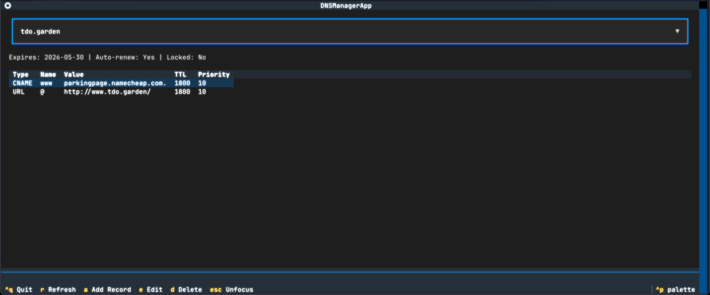

# Namecheap Python SDK

[](https://pypi.org/project/namecheap-python/)
[](https://pepy.tech/project/namecheap-python)
[](https://pepy.tech/project/namecheap-python)
[](https://pypi.org/project/namecheap-python/)
[](https://opensource.org/licenses/MIT)

A modern, friendly Python SDK for the Namecheap API with comprehensive CLI and TUI tools.

## 🚀 Features

- **Modern Python SDK** with full type hints and Pydantic models
- **CLI Tool** for managing domains and DNS from the terminal
- **TUI Application** for visual DNS record management
- **Smart DNS Builder** with fluent interface for record management
- **Auto-configuration** from environment variables
- **Helpful error messages** with troubleshooting guidance
- **Comprehensive logging** with beautiful colored output
- **Sandbox support** for safe testing

## 🎯 Quick Start

**Requires Python 3.12 or higher**

### `namecheap-python`: Core Python SDK Library

```bash
# Add as a dependency to your project
uv add namecheap-python
```

```python
from namecheap import Namecheap

# Initialize (auto-loads from environment)
nc = Namecheap()

# Check domain availability
domains = nc.domains.check("example.com", "coolstartup.io")
for domain in domains:
    if domain.available:
        print(f"✅ {domain.domain} is available!")

# List your domains
my_domains = nc.domains.list()
for domain in my_domains:
    print(f"{domain.name} expires on {domain.expires}")

# Manage DNS with the builder
nc.dns.set("example.com",
    nc.dns.builder()
    .a("@", "192.0.2.1")
    .a("www", "192.0.2.1")  
    .mx("@", "mail.example.com", priority=10)
    .txt("@", "v=spf1 include:_spf.google.com ~all")
)
```

### `namecheap-cli`: CLI tool

It was meant as a proof of concept to showcase `namecheap-python`, but it is a tool that I use

```bash
# List domains with beautiful table output

# Run it without install with:
uvx --from 'namecheap-python[cli]' namecheap-cli domain list

# Or install it permanently with:
uv tool install --python 3.12 'namecheap-python[cli]'

# Then run
namecheap-cli domain list

                    Domains (4 total)
┏━━━━━━━━━━━━━━━━━━━┳━━━━━━━━┳━━━━━━━━━━━━┳━━━━━━━━━━━━┳━━━━━━━━┓
┃ Domain            ┃ Status ┃ Expires    ┃ Auto-Renew ┃ Locked ┃
┡━━━━━━━━━━━━━━━━━━━╇━━━━━━━━╇━━━━━━━━━━━━╇━━━━━━━━━━━━╇━━━━━━━━┩
│ example.com       │ Active │ 2025-10-21 │ ✓          │        │
│ coolsite.io       │ Active │ 2026-05-25 │ ✓          │        │
│ myproject.dev     │ Active │ 2026-05-30 │ ✓          │        │
│ awesome.site      │ Active │ 2026-03-20 │ ✓          │        │
└───────────────────┴────────┴────────────┴────────────┴────────┘
```

Configure it before first use:

```bash
# Interactive setup
namecheap-cli config init

# Creates config file at:
# - Linux/macOS: $XDG_CONFIG_HOME/namecheap/config.yaml (or ~/.config/namecheap/config.yaml)
# - Windows: %APPDATA%\namecheap\config.yaml
```
Check domain availability and pricing:

```bash
# Check domain availability
❯ namecheap-cli domain check myawesome.com coolstartup.io
                Domain Availability
┏━━━━━━━━━━━━━━━━┳━━━━━━━━━━━━━━┳━━━━━━━━━━━━━━━━━━┓
┃ Domain         ┃ Available    ┃ Price (USD/year) ┃
┡━━━━━━━━━━━━━━━━╇━━━━━━━━━━━━━━╇━━━━━━━━━━━━━━━━━━┩
│ myawesome.com  │ ❌ Taken     │ -                │
│ coolstartup.io │ ✅ Available │ $34.98           │
└────────────────┴──────────────┴──────────────────┘

💡 Suggestions for taken domains:
  • myawesome.com → myawesome.net, myawesome.io, getmyawesome.com
```

Manage DNS records:

In this example I'll set up GitHub Pages for my domain `tdo.garden`

```bash
# First, check current DNS records (before setup)
namecheap-cli dns list tdo.garden

# Initial state (Namecheap default parking page):
                         DNS Records for tdo.garden (2 total)
┏━━━━━━━━━━┳━━━━━━━━━━━━━━━━━━━━━━┳━━━━━━━━━━━━━━━━━━━━━━━━━━━━┳━━━━━━━━━━┳━━━━━━━━━━┓
┃ Type     ┃ Name                 ┃ Value                      ┃ TTL      ┃ Priority ┃
┡━━━━━━━━━━╇━━━━━━━━━━━━━━━━━━━━━━╇━━━━━━━━━━━━━━━━━━━━━━━━━━━━╇━━━━━━━━━━╇━━━━━━━━━━┩
│ CNAME    │ www                  │ parkingpage.namecheap.com. │ 1800     │ 10       │
│ URL      │ @                    │ http://www.tdo.garden/     │ 1800     │ 10       │
└──────────┴──────────────────────┴────────────────────────────┴──────────┴──────────┘

# Add GitHub Pages A records for apex domain
❯ namecheap-cli dns add tdo.garden A @ 185.199.108.153
Adding A record to tdo.garden...
✅ Added A record successfully!

❯ namecheap-cli dns add tdo.garden A @ 185.199.109.153
Adding A record to tdo.garden...
✅ Added A record successfully!

❯ namecheap-cli dns add tdo.garden A @ 185.199.110.153
Adding A record to tdo.garden...
✅ Added A record successfully!

❯ namecheap-cli dns add tdo.garden A @ 185.199.111.153
Adding A record to tdo.garden...
✅ Added A record successfully!

# Add CNAME for www subdomain
❯ namecheap-cli dns add tdo.garden CNAME www adriangalilea.github.io
Adding CNAME record to tdo.garden...
✅ Added CNAME record successfully!

# Verify the setup
❯ namecheap-cli dns list tdo.garden

# Final state with GitHub Pages + old records still present that you may want to remove:
```bash
                         DNS Records for tdo.garden (7 total)
┏━━━━━━━━━━┳━━━━━━━━━━━━━━━━━━━━━━┳━━━━━━━━━━━━━━━━━━━━━━━━━━━━┳━━━━━━━━━━┳━━━━━━━━━━┓
┃ Type     ┃ Name                 ┃ Value                      ┃ TTL      ┃ Priority ┃
┡━━━━━━━━━━╇━━━━━━━━━━━━━━━━━━━━━━╇━━━━━━━━━━━━━━━━━━━━━━━━━━━━╇━━━━━━━━━━╇━━━━━━━━━━┩
│ A        │ @                    │ 185.199.108.153            │ 1800     │ 10       │
│ A        │ @                    │ 185.199.109.153            │ 1800     │ 10       │
│ A        │ @                    │ 185.199.110.153            │ 1800     │ 10       │
│ A        │ @                    │ 185.199.111.153            │ 1800     │ 10       │
│ CNAME    │ www                  │ parkingpage.namecheap.com. │ 1800     │ 10       │
│ CNAME    │ www                  │ adriangalilea.github.io.   │ 1800     │ 10       │
│ URL      │ @                    │ http://www.tdo.garden/     │ 1800     │ 10       │
└──────────┴──────────────────────┴────────────────────────────┴──────────┴──────────┘
```


Check account balance:

```bash
❯ namecheap-cli account balance
          Account Balance
┏━━━━━━━━━━━━━━━━━━━━━┳━━━━━━━━━━━┓
┃ Field               ┃    Amount ┃
┡━━━━━━━━━━━━━━━━━━━━━╇━━━━━━━━━━━┩
│ Available Balance   │  0.00 USD │
│ Account Balance     │  0.00 USD │
│ Earned Amount       │  0.00 USD │
│ Withdrawable        │  0.00 USD │
│ Auto-Renew Required │ 20.16 USD │
└─────────────────────┴───────────┘
```

Get detailed domain info:

```bash
❯ namecheap-cli domain info self.fm

Domain Information: self.fm

Status: Ok
Owner: adriangalilea
Created: 07/15/2023
Expires: 07/15/2026
Premium: No
WHOIS Guard: ✓ Enabled
DNS Provider: CUSTOM
```

You can also export DNS records:

```bash
namecheap-cli dns export example.com --format yaml
```
### `namecheap-dns-tui`: TUI for DNS management

```bash
# Launch interactive DNS manager
namecheap-dns-tui
```



## Install both the CLI and TUI

```bash
uv tool install --python 3.12 'namecheap-python[all]'
```

## 📖 Documentation

- **[Examples Overview](examples/README.md)** - Quick examples for all tools
- **[CLI Documentation](src/namecheap_cli/README.md)** - Complete CLI reference
- **[TUI Documentation](src/namecheap_dns_tui/README.md)** - TUI features and usage
- **[SDK Quickstart](examples/quickstart.py)** - Python code examples

## ⚙️ Configuration

### Environment Variables

Create a `.env` file or set environment variables:

```bash
# Required
NAMECHEAP_API_KEY=your-api-key
NAMECHEAP_USERNAME=your-username

# Optional
NAMECHEAP_API_USER=api-username  # defaults to USERNAME
NAMECHEAP_CLIENT_IP=auto         # auto-detected if not set
NAMECHEAP_SANDBOX=false          # use production API
```

### Python Configuration

```python
from namecheap import Namecheap

nc = Namecheap(
    api_key="your-api-key",
    username="your-username", 
    api_user="api-username",    # Optional
    client_ip="1.2.3.4",       # Optional, auto-detected
    sandbox=False              # Production mode
)
```

## 🔧 Advanced SDK Usage

### DNS Builder Pattern

The DNS builder provides a fluent interface for managing records:

```python
# Build complex DNS configurations
nc.dns.set("example.com",
    nc.dns.builder()
    # A records
    .a("@", "192.0.2.1")
    .a("www", "192.0.2.1")
    .a("blog", "192.0.2.2")
    
    # AAAA records  
    .aaaa("@", "2001:db8::1")
    .aaaa("www", "2001:db8::1")
    
    # MX records
    .mx("@", "mail.example.com", priority=10)
    .mx("@", "mail2.example.com", priority=20)
    
    # TXT records
    .txt("@", "v=spf1 include:_spf.google.com ~all")
    .txt("_dmarc", "v=DMARC1; p=none;")
    
    # CNAME records
    .cname("blog", "myblog.wordpress.com")
    .cname("shop", "myshop.shopify.com")
    
    # URL redirects
    .url("old", "https://new-site.com", redirect_type="301")
)
```

**Note on TTL:** The default TTL is **1799 seconds**, which displays as **"Automatic"** in the Namecheap web interface. This is an undocumented Namecheap API behavior. You can specify custom TTL values (60-86400 seconds) in any DNS method.

### Nameserver Management

```python
# Check current nameservers
ns = nc.dns.get_nameservers("example.com")
print(ns.nameservers)  # ['dns1.registrar-servers.com', 'dns2.registrar-servers.com']
print(ns.is_default)   # True

# Switch to custom nameservers (e.g., Cloudflare, Route 53)
nc.dns.set_custom_nameservers("example.com", [
    "ns1.cloudflare.com",
    "ns2.cloudflare.com",
])

# Reset back to Namecheap BasicDNS
nc.dns.set_default_nameservers("example.com")
```

### Domain Info

```python
info = nc.domains.get_info("example.com")
print(info.status)              # 'Ok'
print(info.whoisguard_enabled)  # True
print(info.dns_provider)        # 'CUSTOM'
print(info.created)             # '07/15/2023'
print(info.expires)             # '07/15/2026'
```

### Account Balance

```python
bal = nc.users.get_balances()
print(f"{bal.available_balance} {bal.currency}")  # '4932.96 USD'
print(bal.funds_required_for_auto_renew)          # Decimal('20.16')
```

### Email Forwarding

```python
# Read
rules = nc.dns.get_email_forwarding("example.com")
for r in rules:
    print(f"{r.mailbox} -> {r.forward_to}")

# Write (replaces all existing rules)
nc.dns.set_email_forwarding("example.com", [
    EmailForward(mailbox="info", forward_to="me@gmail.com"),
    EmailForward(mailbox="support", forward_to="help@gmail.com"),
])
```

### Domain Contacts

```python
contacts = nc.domains.get_contacts("example.com")
print(f"{contacts.registrant.first_name} {contacts.registrant.last_name}")
print(contacts.registrant.email)
```

### Domain Management

```python
# Check multiple domains with pricing
results = nc.domains.check(
    "example.com", 
    "coolstartup.io",
    "myproject.dev",
    include_pricing=True
)

for domain in results:
    if domain.available:
        print(f"✅ {domain.domain} - ${domain.price}/year")
    else:
        print(f"❌ {domain.domain} is taken")

# List domains with filters
domains = nc.domains.list()
expiring_soon = [d for d in domains if (d.expires - datetime.now()).days < 30]

# Register a domain
from namecheap import Contact

contact = Contact(
    first_name="John",
    last_name="Doe", 
    address1="123 Main St",
    city="New York",
    state_province="NY",
    postal_code="10001", 
    country="US",
    phone="+1.2125551234",
    email="john@example.com"
)

result = nc.domains.register(
    "mynewdomain.com",
    years=2,
    contact=contact,
    whois_protection=True
)
```

### Error Handling

```python
from namecheap import NamecheapError

try:
    nc.domains.check("example.com")
except NamecheapError as e:
    print(f"Error: {e.message}")
    if e.help:
        print(f"💡 Tip: {e.help}")
```

## ⚠️ Namecheap API Quirks

This section documents undocumented or unusual Namecheap API behaviors we've discovered:

### TTL "Automatic" = 1799 seconds

The Namecheap web interface displays TTL as **"Automatic"** when the value is exactly **1799 seconds**, but shows **"30 min"** when it's **1800 seconds**. This behavior is completely undocumented in their official API documentation.

Their API docs state TTL defaults to 1800 when omitted, but the UI treats 1799 specially. This SDK defaults to 1799 to match the "Automatic" behavior users see in the web interface.

```python
# Both are valid, but display differently in Namecheap UI:
nc.dns.builder().a("www", "192.0.2.1", ttl=1799)  # Shows as "Automatic"
nc.dns.builder().a("www", "192.0.2.1", ttl=1800)  # Shows as "30 min"
```

## 📊 [API Coverage](https://www.namecheap.com/support/api/methods/)

| API | Status | Methods |
|-----|--------|---------|
| `namecheap.domains.*` | ✅ Done | `check`, `list`, `getInfo`, `getContacts`, `register`, `renew`, `setContacts`, `lock`/`unlock` |
| `namecheap.domains.dns.*` | ✅ Done | `getHosts`, `setHosts` (builder pattern), `add`, `delete`, `export`, `getList`, `setCustom`, `setDefault`, `getEmailForwarding`, `setEmailForwarding` |
| `namecheap.users.*` | ⚠️ Partial | `getBalances`, `getPricing` (needs debugging). Planned: `changePassword`, `update`, `create`, `login`, `resetPassword` |
| `namecheap.domains.*` | 🚧 Planned | `getTldList`, `reactivate` |
| `namecheap.users.address.*` | 🚧 Planned | `create`, `delete`, `getInfo`, `getList`, `setDefault`, `update` |
| `namecheap.ssl.*` | 🚧 Planned | `create`, `activate`, `renew`, `revoke`, `getList`, `getInfo`, `parseCSR`, `reissue`, and more |
| `namecheap.domains.transfer.*` | 🚧 Planned | `create`, `getStatus`, `updateStatus`, `getList` |
| `namecheap.domains.ns.*` | 🚧 Planned | Glue records — `create`, `delete`, `getInfo`, `update` |
| `namecheap.domainprivacy.*` | 🚧 Planned | `enable`, `disable`, `renew`, `getList`, `changeemailaddress` |

## 🛠️ Development

See [CONTRIBUTING.md](CONTRIBUTING.md) for setup and development guidelines.

## 📝 License

MIT License - see [LICENSE](LICENSE) file for details.

## 🤝 Contributing

Contributions are welcome! Please feel free to submit a Pull Request. See the [Development Guide](docs/dev/README.md) for setup instructions and guidelines.

### Contributors

- [@huntertur](https://github.com/huntertur) — Rich dependency fix
- [@jeffmcadams](https://github.com/jeffmcadams) — Domain serialization round-trip
- [@cosmin](https://github.com/cosmin) — Nameserver management
